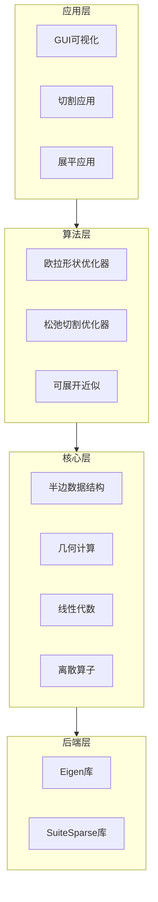
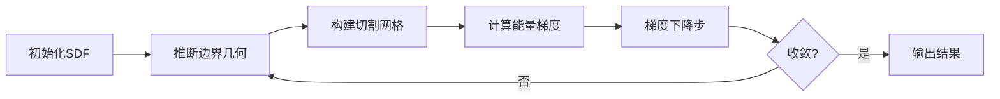

# 变分曲面切割技术架构文档

## 目录

1. [项目概述](#1-项目概述)
2. [整体架构设计](#2-整体架构设计)
3. [核心数据结构](#3-核心数据结构)
4. [几何计算引擎](#4-几何计算引擎)
5. [线性代数求解器架构](#5-线性代数求解器架构)
6. [变分曲面切割算法](#6-变分曲面切割算法)
7. [离散微分几何算子](#7-离散微分几何算子)
8. [方向场与向量场处理](#8-方向场与向量场处理)
9. [快速行进法实现](#9-快速行进法实现)
10. [工具函数与实用程序](#10-工具函数与实用程序)
11. [项目组织结构](#11-项目组织结构)
12. [关键设计模式](#12-关键设计模式)
13. [性能优化策略](#13-性能优化策略)

---

## 1. 项目概述

### 1.1 项目简介

**Variational Surface Cutting** 是一个用于三维曲面切割和参数化的高性能计算框架。该项目实现了基于变分方法的曲面切割算法，能够将复杂的三维曲面分解为可展开的二维片段，广泛应用于计算机图形学、计算几何和数字制造等领域。

### 1.2 核心功能

- **变分切割优化**：通过能量最小化方法寻找最优切割线
- **曲面参数化**：将三维曲面映射到二维平面
- **可展开近似**：生成接近可展开的曲面片段
- **方向场计算**：在曲面上计算和优化方向场
- **测地线计算**：使用快速行进法计算测地距离

### 1.3 技术特点

- **高性能计算**：使用稀疏矩阵和优化的线性求解器
- **模块化设计**：清晰的层次结构和接口定义
- **双重后端支持**：同时支持 Eigen 和 SuiteSparse
- **泛型编程**：大量使用 C++ 模板实现代码复用

---

## 2. 整体架构设计

### 2.1 系统架构图



### 2.2 模块职责

#### 2.2.1 核心层 (Core)

负责提供基础数据结构和算法实现：

- **半边网格**：连通性表示和拓扑操作
- **几何计算**：度量计算、法向量、曲率等
- **线性代数**：稀疏矩阵、求解器封装
- **离散算子**：微分几何算子实现

#### 2.2.2 算法层 (Algorithm)

实现高级算法和优化方法：

- **形状优化**：基于梯度的形状优化
- **切割优化**：寻找最优切割路径
- **参数化**：共形映射、等距映射

#### 2.2.3 应用层 (Application)

提供用户接口和可视化：

- **GUI框架**：OpenGL渲染和交互
- **具体应用**：切割工具、展平工具

---

## 3. 核心数据结构

### 3.1 半边数据结构 (Halfedge Mesh)

#### 3.1.1 设计理念

半边数据结构是整个系统的核心，提供了高效的网格拓扑表示和遍历能力。

```cpp
class HalfedgeMesh {
    // 原始数据存储（连续内存）
    std::vector<Halfedge> rawHalfedges;
    std::vector<Vertex> rawVertices;
    std::vector<Edge> rawEdges;
    std::vector<Face> rawFaces;
    std::vector<Halfedge> rawImaginaryHalfedges;  // 边界半边
    std::vector<Face> rawBoundaryLoops;           // 边界环
};
```

#### 3.1.2 核心元素

**Halfedge（半边）**
```cpp
class Halfedge {
    Halfedge* twin;    // 对偶半边
    Halfedge* next;    // 下一条半边
    Vertex* vertex;    // 目标顶点
    Edge* edge;        // 所属边
    Face* face;        // 相邻面
    bool isReal;       // 是否为真实半边
};
```

**Vertex（顶点）**
```cpp
class Vertex {
    Halfedge* halfedge;  // 出发半边
    bool isBoundary;     // 是否为边界顶点
};
```

**Edge（边）**
```cpp
class Edge {
    Halfedge* halfedge;  // 关联半边
    bool isBoundary;     // 是否为边界边
    bool isCut;          // 是否为切割边
};
```

**Face（面）**
```cpp
class Face {
    Halfedge* halfedge;  // 边界半边
    bool isBoundary;     // 是否为边界面
    bool isReal;         // 是否为真实面
};
```

#### 3.1.3 智能指针系统

项目实现了一套轻量级的智能指针系统，提供类型安全和便捷的访问：

```cpp
class HalfedgePtr {
    Halfedge* ptr;

public:
    // 拓扑导航
    HalfedgePtr twin() const;
    HalfedgePtr next() const;
    HalfedgePtr prev() const;
    VertexPtr vertex() const;
    EdgePtr edge() const;
    FacePtr face() const;
};
```

#### 3.1.4 迭代器系统

支持现代 C++ 的范围循环：

```cpp
// 遍历所有顶点
for(VertexPtr v : mesh->vertices()) {
    // 处理顶点
}

// 遍历顶点的邻接面
for(FacePtr f : v.adjacentFaces()) {
    // 处理邻接面
}
```

### 3.2 数据关联系统

#### 3.2.1 模板化数据容器

为网格元素关联任意类型的数据：

```cpp
template<typename T>
class VertexData : public DataGCMap<Vertex, T> {
    // 为每个顶点存储类型T的数据
};

template<typename T>
class FaceData : public DataGCMap<Face, T> {
    // 为每个面存储类型T的数据
};
```

使用示例：
```cpp
VertexData<double> scalarField(mesh);
FaceData<Vector3> faceNormals(mesh);

// 访问和修改
scalarField[vertex] = 1.0;
Vector3 normal = faceNormals[face];
```

### 3.3 对偶网格

支持原始网格和对偶网格之间的转换：

```cpp
class HalfedgeDual {
    // 对偶关系：
    // 原始顶点 <-> 对偶面
    // 原始边 <-> 对偶边
    // 原始面 <-> 对偶顶点
};
```

---

## 4. 几何计算引擎

### 4.1 Geometry 类设计

#### 4.1.1 类层次结构

```cpp
template<class T>
class Geometry : public VertexData<T> {
    HalfedgeMesh& mesh;
    DualType dualType;  // 对偶类型（重心、外心等）
};
```

支持的几何类型：
- `Euclidean` (Vector3)：三维欧几里得空间
- `Planar` (Vector2)：二维平面
- `Spherical` (UnitVector3)：球面几何

#### 4.1.2 几何量计算

**顶点属性**
```cpp
// 位置
T position(VertexPtr v);

// 法向量（面积加权平均）
Vector3 normal(VertexPtr v);

// 角度亏损（2π - 邻接角之和）
double angleDefect(VertexPtr v);

// 主方向
Complex principalDirection(VertexPtr v);
```

**边属性**
```cpp
// 边长度
double length(EdgePtr e);

// 余切权重（离散拉普拉斯算子）
double cotanWeight(EdgePtr e);

// 二面角
double dihedralAngle(EdgePtr e);
```

**面属性**
```cpp
// 面积
double area(FacePtr f);

// 法向量
Vector3 normal(FacePtr f);

// 重心
T barycenter(FacePtr f);

// 外心
T circumcenter(FacePtr f);
```

### 4.2 缓存机制

几何量的计算采用懒惰求值和缓存策略：

```cpp
void Geometry::getFaceAreas(FaceData<double>& faceArea) {
    // 批量计算并缓存面积
    for(FacePtr f : mesh.faces()) {
        faceArea[f] = computeArea(f);
    }
}
```

### 4.3 投影与坐标转换

**切平面投影**
```cpp
Vector3 projectToTangentSpace(VertexPtr v, const Vector3& vec) {
    Vector3 n = normal(v);
    return vec - dot(vec, n) * n;
}
```

**复数角度表示**
```cpp
Complex tangentVectorToComplexAngle(VertexPtr v, const Vector3& vec);
Vector3 complexAngleToTangentVector(VertexPtr v, Complex angle);
```

---

## 5. 线性代数求解器架构

### 5.1 稀疏矩阵实现

#### 5.1.1 SparseMatrix 类

```cpp
template<typename T>
class SparseMatrix {
    size_t m, n;  // 矩阵维度
    std::map<EntryIndex, T> data;  // 稀疏存储
    SparseFactorization<T> factors;  // 缓存的因子分解
};
```

#### 5.1.2 双后端支持

项目同时支持两种线性代数后端：

**Eigen 后端**
- 纯 C++ 实现
- 无外部依赖
- 适合中小规模问题

**SuiteSparse 后端**
- 高性能 BLAS/LAPACK
- 适合大规模问题
- 需要外部库依赖

### 5.2 求解器接口

#### 5.2.1 直接求解器

```cpp
// LU 分解（一般方阵）
void solveSquare(SparseMatrix<T>& A, DenseMatrix<T>& x, DenseMatrix<T> b);

// Cholesky 分解（正定矩阵）
void solvePositiveDefinite(SparseMatrix<T>& A, DenseMatrix<T>& x, DenseMatrix<T> b);

// LDL^T 分解（不定矩阵）
void solveIndefinite(SparseMatrix<T>& A, DenseMatrix<T>& x, DenseMatrix<T> b);

// QR 分解（最小二乘）
void solveLeastSquares(SparseMatrix<T>& A, DenseMatrix<T>& x, DenseMatrix<T> b);
```

#### 5.2.2 迭代求解器

```cpp
// 共轭梯度法
void solveConjugateGradient(
    SparseMatrix<T>& A,
    SparseMatrix<T>& M,  // 预条件子
    DenseMatrix<T>& x,
    DenseMatrix<T>& b,
    double tolerance = 1e-7
);
```

#### 5.2.3 特征值求解

```cpp
// 最小特征值
void smallestEig(SparseMatrix<T>& A, DenseMatrix<T>& x);

// 广义特征值问题
void smallestEig(SparseMatrix<T>& A, SparseMatrix<T>& B, DenseMatrix<T>& x);
```

### 5.3 因子分解缓存

```cpp
class SparseFactorization {
    // 符号分解（拓扑结构）
    void computeSymbolic();

    // 数值分解
    void computeNumeric();

    // 求解
    void solve(DenseMatrix<T>& x, const DenseMatrix<T>& b);
};
```

---

## 6. 变分曲面切割算法

### 6.1 欧拉形状优化器

#### 6.1.1 核心思想

通过隐式表示（水平集方法）优化切割边界：

```cpp
class EulerianShapeOptimizer {
    // 核心状态：K个区域的符号距离函数
    VertexData<LabelVec> phi;  // LabelVec = Eigen::Matrix<double, K_REGIONS, 1>

    // 能量权重
    double weightLengthRegularization;  // 边界长度正则化
    double weightDirichletDistortion;   // Dirichlet失真
    double weightHenckyDistortion;      // Hencky失真
    double weightVisibility;            // 可见性
    double weightArea;                  // 面积
};
```

#### 6.1.2 优化流程



#### 6.1.3 边界表示

```cpp
struct BoundarySegment {
    BType type;           // TRI(三角形内), QUAD(穿过边), TRIPLE(三重点)
    HalfedgePtr heStart;  // 起始半边
    HalfedgePtr heEnd;    // 结束半边
    double tStart, tEnd;  // 参数化坐标
    Vector3 triplePoint;  // 三重点位置
};
```

### 6.2 能量函数

#### 6.2.1 边界长度正则化

最小化切割边界的总长度：

```cpp
double evaluateEnergyTermLengthRegularization() {
    double energy = 0;
    for(auto& regionBoundary : boundarySegments) {
        for(auto& segment : regionBoundary) {
            energy += boundaryLength(segment);
        }
    }
    return energy;
}
```

#### 6.2.2 失真度量

**Dirichlet 能量**

衡量参数化的保角性：

```cpp
E_Dirichlet = ∫_Ω ||∇u||² dA
```

**Hencky 应变能量**

衡量可展开性：

```cpp
E_Hencky = ∫_Ω (log(σ₁)² + log(σ₂)²) dA
```

其中 σ₁, σ₂ 是奇异值。

### 6.3 梯度计算与优化

#### 6.3.1 梯度构建

```cpp
void buildGradientAtBoundary() {
    // 初始化边界梯度
    initializeBoundaryGradient();

    // 添加各项能量的梯度贡献
    if(weightLengthRegularization > 0)
        addBoundaryGradientTermLengthRegularization();
    if(weightDirichletDistortion > 0)
        addBoundaryGradientTermDirichletDistortion();
    // ...
}
```

#### 6.3.2 梯度扩展

将边界上的梯度扩展到整个曲面：

```cpp
VertexData<LabelVec> extendGradientToSurface() {
    // 使用热扩散方程将边界梯度平滑扩展
    // ∆u = 0 内部
    // u = g 边界
}
```

#### 6.3.3 线搜索

使用 Armijo 线搜索确定步长：

```cpp
int doStepLineSearch() {
    double c1 = 0.1;  // Armijo常数
    double alpha = 1.0;  // 初始步长

    while(newEnergy > oldEnergy - c1 * alpha * gradientNorm) {
        alpha *= 0.5;  // 缩小步长
        // 重新计算
    }
}
```

---

## 7. 离散微分几何算子

### 7.1 外微分算子

#### 7.1.1 离散外导数

```cpp
// d₀: 0-形式 -> 1-形式 (梯度)
SparseMatrix<T> buildDerivative0(HalfedgeMesh* mesh) {
    // 对每条边 e = (i,j)
    // d₀[e][i] = -1
    // d₀[e][j] = +1
}

// d₁: 1-形式 -> 2-形式 (旋度)
SparseMatrix<T> buildDerivative1(HalfedgeMesh* mesh) {
    // 对每个面，沿边界积分
}
```

#### 7.1.2 Hodge 星算子

```cpp
// ⋆₀: 0-形式的 Hodge 星（顶点面积）
SparseMatrix<T> buildHodge0(Geometry<D>* geometry) {
    // 对角矩阵，元素为顶点的对偶面积
}

// ⋆₁: 1-形式的 Hodge 星（边权重）
SparseMatrix<T> buildHodge1(Geometry<D>* geometry) {
    // 对角矩阵，元素为边的 Hodge 权重
    // w_ij = (cot α + cot β) / 2
}

// ⋆₂: 2-形式的 Hodge 星（面积倒数）
SparseMatrix<T> buildHodge2(Geometry<D>* geometry) {
    // 对角矩阵，元素为 1/面积
}
```

### 7.2 离散拉普拉斯算子

#### 7.2.1 余切拉普拉斯

```cpp
SparseMatrix<T> cotanMatrix(Geometry<G>* geometry, VertexData<size_t> index) {
    // L[i][j] = -w_ij (i ≠ j)
    // L[i][i] = Σ_j w_ij
    // 其中 w_ij = (cot α_ij + cot β_ij) / 2
}
```

#### 7.2.2 质量矩阵

```cpp
SparseMatrix<T> vertexMassMatrix(Geometry<G>* geometry, VertexData<size_t> index) {
    // 对角矩阵
    // M[i][i] = 顶点 i 的 Voronoi 面积
}
```

### 7.3 微分几何量计算

#### 7.3.1 高斯曲率

通过角度亏损计算：

```cpp
double gaussianCurvature(VertexPtr v) {
    return angleDefect(v) / vertexArea(v);
}
```

#### 7.3.2 平均曲率

通过拉普拉斯-贝尔特拉米算子：

```cpp
Vector3 meanCurvatureVector(VertexPtr v) {
    Vector3 laplacian = Vector3::zero();
    for(HalfedgePtr he : v.outgoingHalfedges()) {
        laplacian += cotanWeight(he) * (position(he.vertex()) - position(v));
    }
    return laplacian / (2 * vertexArea(v));
}
```

---

## 8. 方向场与向量场处理

### 8.1 方向场表示

#### 8.1.1 复数表示

在切平面上用复数表示 n-对称方向场：

```cpp
VertexData<Complex> directionField;  // n-RoSy场

// n=1: 向量场
// n=2: 线场
// n=4: 十字场
```

#### 8.1.2 平行输运

计算半边之间的平行输运角度：

```cpp
HalfedgeData<double> computeTransportAngles(Geometry<Euclidean>* geometry) {
    // 对每条半边 he
    // transport[he] = 从 he.vertex() 到 he.twin().vertex() 的平行输运角
}
```

### 8.2 最光滑方向场

#### 8.2.1 能量函数

最小化 Dirichlet 能量：

```cpp
E = Σ_edges |X_i - r_ij^n * X_j|²
```

其中 r_ij 是平行输运。

#### 8.2.2 求解方法

```cpp
VertexData<Complex> computeSmoothestDirectionField(
    Geometry<Euclidean>* geometry,
    int nSym,              // 对称度
    bool alignCurvature    // 是否与主曲率对齐
) {
    // 构建能量矩阵
    SparseMatrix<Complex> L = buildConnectionLaplacian(nSym);

    // 添加曲率对齐项
    if(alignCurvature) {
        L += curvatureAlignmentTerm();
    }

    // 求解最小特征值问题
    DenseMatrix<Complex> x;
    smallestEig(L, x);

    return x;
}
```

### 8.3 奇异点检测

#### 8.3.1 指数计算

```cpp
FaceData<int> computeFaceIndex(
    Geometry<Euclidean>* geometry,
    VertexData<Complex> directionField,
    int nSym
) {
    FaceData<int> index(mesh);

    for(FacePtr f : mesh->faces()) {
        double angleSum = 0;

        // 沿面边界积分
        for(HalfedgePtr he : f.adjacentHalfedges()) {
            angleSum += connectionAngle(he, directionField, nSym);
        }

        index[f] = round(angleSum / (2*PI/nSym));
    }

    return index;
}
```

---

## 9. 快速行进法实现

### 9.1 算法概述

快速行进法（Fast Marching Method）用于计算测地距离：

```cpp
VertexData<double> FMMDistance(
    Geometry<Euclidean>* geometry,
    const std::vector<std::pair<VertexPtr, double>>& initialDistances
);
```

### 9.2 核心实现

#### 9.2.1 数据结构

```cpp
// 顶点状态
enum class FMMStatus {
    FAR,      // 未处理
    TRIAL,    // 待处理（在优先队列中）
    KNOWN     // 已确定
};

// 优先队列
std::priority_queue<
    std::pair<double, VertexPtr>,
    std::vector<std::pair<double, VertexPtr>>,
    std::greater<>
> trialQueue;
```

#### 9.2.2 更新规则

对于三角形内的距离更新：

```cpp
double eikonalDistanceSubroutine(
    double a, double b,     // 边长
    double theta,           // 夹角
    double dA, double dB    // 已知距离
) {
    // 求解 Eikonal 方程
    // |∇u| = 1
    // 使用二次公式
}
```

### 9.3 应用场景

- 测地线计算
- 最短路径
- Voronoi 图
- 距离场生成

---

## 10. 工具函数与实用程序

### 10.1 数学工具

#### 10.1.1 向量运算

```cpp
struct Vector3 {
    double x, y, z;

    // 基本运算
    Vector3 operator+(const Vector3& v);
    Vector3 operator-(const Vector3& v);
    Vector3 operator*(double s);

    // 几何运算
    void normalize();
    Vector3 rotate_around(Vector3 axis, double theta);
};

// 全局函数
double dot(const Vector3& u, const Vector3& v);
Vector3 cross(const Vector3& u, const Vector3& v);
double angle(const Vector3& u, const Vector3& v);
```

#### 10.1.2 四元数

```cpp
class Quaternion {
    double re;      // 实部
    Vector3 im;     // 虚部

    // 旋转表示
    static Quaternion fromAxisAngle(Vector3 axis, double angle);
    Vector3 rotate(const Vector3& v);
};
```

### 10.2 网格 I/O

#### 10.2.1 支持格式

```cpp
class MeshIO {
    static bool readMesh(std::string filename, PolygonSoupMesh& soup);
    static bool writeMesh(std::string filename,
                         Geometry<Euclidean>* geometry);
};
```

支持的格式：
- OBJ (Wavefront)
- PLY (Stanford)
- OFF (Object File Format)

### 10.3 对称检测

```cpp
struct SymmetryResult {
    bool hasSymmetry;
    Plane symmetryPlane;
    VertexData<VertexPtr> symmetricVertex;
};

SymmetryResult detectSymmetry(Geometry<Euclidean>* geometry);
```

### 10.4 并查集

用于连通分量分析：

```cpp
class DisjointSets {
    std::vector<size_t> parent;
    std::vector<size_t> rank;

public:
    void makeSet(size_t i);
    size_t find(size_t i);
    void unionSets(size_t i, size_t j);
};
```

---

## 11. 项目组织结构

### 11.1 目录结构

```
variational-surface-cutting/
├── core/                    # 核心库
│   ├── include/            # 头文件
│   │   ├── halfedge_*.h   # 半边数据结构
│   │   ├── geometry.h     # 几何计算
│   │   ├── sparse_matrix.h # 稀疏矩阵
│   │   ├── eigen_wrapper/  # Eigen封装
│   │   └── suitesparse_wrapper/ # SuiteSparse封装
│   └── src/                # 实现文件
│
├── projects/               # 具体项目
│   ├── cuts/              # 切割应用
│   │   ├── core/         # 切割算法
│   │   └── gui/          # 切割界面
│   └── flatten/           # 展平应用
│       ├── core/         # 展平算法
│       └── gui/          # 展平界面
│
├── gui/                   # GUI框架
│   ├── include/          # GUI头文件
│   └── src/              # GUI实现
│
└── deps/                  # 第三方依赖
    ├── eigen/            # Eigen库
    └── imgui/            # ImGui库
```

### 11.2 CMake 构建系统

```cmake
# 主CMakeLists.txt
cmake_minimum_required(VERSION 3.10)
project(variational-surface-cutting)

# 设置C++标准
set(CMAKE_CXX_STANDARD 17)

# 查找依赖
find_package(Eigen3 REQUIRED)
find_package(SuiteSparse OPTIONAL)

# 构建核心库
add_subdirectory(core)

# 构建GUI
add_subdirectory(gui)

# 构建项目
add_subdirectory(projects)
```

---

## 12. 关键设计模式

### 12.1 访问者模式变体

使用指针包装类实现类型安全的元素访问：

```cpp
class VertexPtr {
    Vertex* ptr;
public:
    // 自动解引用
    Vertex* operator->();

    // 拓扑导航
    HalfedgePtr halfedge();

    // 迭代器
    VertexAdjacentFaceSet adjacentFaces();
};
```

### 12.2 缓存模式

几何量的懒惰求值和缓存：

```cpp
class EulerianShapeOptimizer {
    bool haveBoundaryGeometry = false;

    void ensureHaveBoundaryGeometry() {
        if(!haveBoundaryGeometry) {
            inferBoundaryGeometry();
            haveBoundaryGeometry = true;
        }
    }
};
```

### 12.3 模板方法模式

求解器的通用接口：

```cpp
template<typename T>
class Solver {
    virtual void factorize() = 0;
    virtual void solve(const T& b, T& x) = 0;

    void solveProblem(const T& b, T& x) {
        factorize();  // 模板方法
        solve(b, x);
    }
};
```

### 12.4 策略模式

不同的参数化策略：

```cpp
class ParameterizationStrategy {
    virtual CornerData<Vector2> parameterize(
        Geometry<Euclidean>* geom) = 0;
};

class ConformalParameterization : public ParameterizationStrategy {
    // 共形参数化
};

class IsometricParameterization : public ParameterizationStrategy {
    // 等距参数化
};
```

---

## 13. 性能优化策略

### 13.1 内存优化

#### 13.1.1 连续内存布局

网格元素存储在连续的 vector 中：

```cpp
std::vector<Vertex> rawVertices;  // 缓存友好
// 而非
std::vector<Vertex*> vertices;    // 指针跳转
```

#### 13.1.2 数据局部性

相关数据打包存储：

```cpp
struct VertexGeometry {
    Vector3 position;
    Vector3 normal;
    double area;
    // 一次缓存加载获取所有数据
};
```

### 13.2 计算优化

#### 13.2.1 批量操作

```cpp
// 批量计算所有面积
void getFaceAreas(FaceData<double>& areas) {
    // 一次遍历计算所有值
    // 避免重复遍历
}
```

#### 13.2.2 稀疏矩阵优化

- 使用压缩列存储（CSC）
- 符号分解重用
- 数值分解缓存

```cpp
class FastCholesky {
    // 仅更新改变的矩阵元素
    void updateFactorization(/* changes */);
};
```

### 13.3 并行化策略

#### 13.3.1 OpenMP 并行

```cpp
#pragma omp parallel for
for(int i = 0; i < nVertices; i++) {
    // 并行处理顶点
}
```

#### 13.3.2 SIMD 优化

使用 Eigen 的向量化：

```cpp
// Eigen 自动向量化
Eigen::VectorXd result = matrix * vector;
```

### 13.4 算法优化

#### 13.4.1 层次化数据结构

- 边界层次树（BVH）用于射线追踪
- 空间哈希用于邻域查询

#### 13.4.2 自适应精度

```cpp
class AdaptiveOptimizer {
    // 粗网格快速收敛
    void coarseOptimization();

    // 细化到目标精度
    void refinement();
};
```

---

## 附录A：关键算法伪代码

### A.1 变分切割主循环

```
算法：变分曲面切割
输入：网格 M，初始切割 C₀
输出：优化后的切割 C*

1. 初始化符号距离函数 φ
2. while 未收敛:
   3. 根据 φ 推断边界位置
   4. 构建切割网格
   5. 计算能量梯度 ∇E
   6. 线搜索确定步长 α
   7. 更新 φ ← φ - α·∇E
   8. 投影到约束空间
9. 返回最终切割
```

### A.2 快速行进法

```
算法：快速行进法
输入：种子点集合 S，初始距离 d₀
输出：测地距离场 d

1. 初始化：
   - 所有顶点标记为 FAR
   - 种子点标记为 KNOWN，设置距离
   - 种子邻居加入优先队列

2. while 优先队列非空:
   3. 取出最小距离顶点 v
   4. 标记 v 为 KNOWN
   5. for v 的每个 FAR 邻居 u:
      6. 计算新距离 d_new
      7. if d_new < d[u]:
         8. 更新 d[u] = d_new
         9. 将 u 加入优先队列

10. 返回距离场 d
```

---

## 附录B：性能基准

### B.1 典型操作时间复杂度

| 操作 | 时间复杂度 | 空间复杂度 |
|-----|-----------|-----------|
| 半边遍历 | O(1) | O(1) |
| 顶点一环遍历 | O(k) | O(1) |
| 稀疏矩阵构建 | O(n) | O(n) |
| Cholesky分解 | O(n^1.5) | O(n log n) |
| 快速行进法 | O(n log n) | O(n) |
| 方向场计算 | O(n) | O(n) |

### B.2 内存使用估算

对于 n 个顶点的三角网格：

- 半边数据结构：约 6n × 40 字节
- 几何数据：n × 24 字节（位置）
- 稀疏矩阵：约 7n × 16 字节（平均度数7）
- 总计：约 500 字节/顶点

---

## 附录C：扩展与定制

### C.1 添加新的能量项

```cpp
// 1. 在 EulerianShapeOptimizer 中添加权重
double weightCustomEnergy = 1.0;

// 2. 实现能量计算
double evaluateEnergyTermCustom() {
    // 计算能量值
}

// 3. 实现梯度计算
void addBoundaryGradientTermCustom() {
    // 添加梯度贡献
}

// 4. 在主循环中调用
if(weightCustomEnergy > 0) {
    energy += weightCustomEnergy * evaluateEnergyTermCustom();
    addBoundaryGradientTermCustom();
}
```

### C.2 自定义几何类型

```cpp
// 定义新的几何类型
struct HyperbolicPoint {
    double x, y;  // Poincaré 圆盘坐标

    // 必需的操作
    HyperbolicPoint operator+(const HyperbolicPoint& p);
    HyperbolicPoint operator*(double s);
    static HyperbolicPoint zero();
};

// 特化 Geometry 类
template<>
class Geometry<HyperbolicPoint> : public VertexData<HyperbolicPoint> {
    // 实现双曲几何的度量计算
};
```

---

## 总结

变分曲面切割项目展示了现代计算几何系统的设计范例：

1. **模块化架构**：清晰的层次结构，便于扩展和维护
2. **高性能实现**：通过缓存、稀疏计算和并行化实现高效计算
3. **数学严谨性**：基于坚实的微分几何和优化理论
4. **工程实用性**：提供完整的工具链和用户界面

该系统不仅可用于曲面切割，其核心组件还可应用于：
- 网格参数化
- 形状分析
- 数字制造
- 计算机动画
- 有限元分析

通过本文档的详细分析，读者应能够理解系统的设计理念、实现细节和扩展方法，为进一步的开发和研究奠定基础。

---

*文档版本：1.0*
*生成日期：2024年*
*作者：技术架构分析团队*