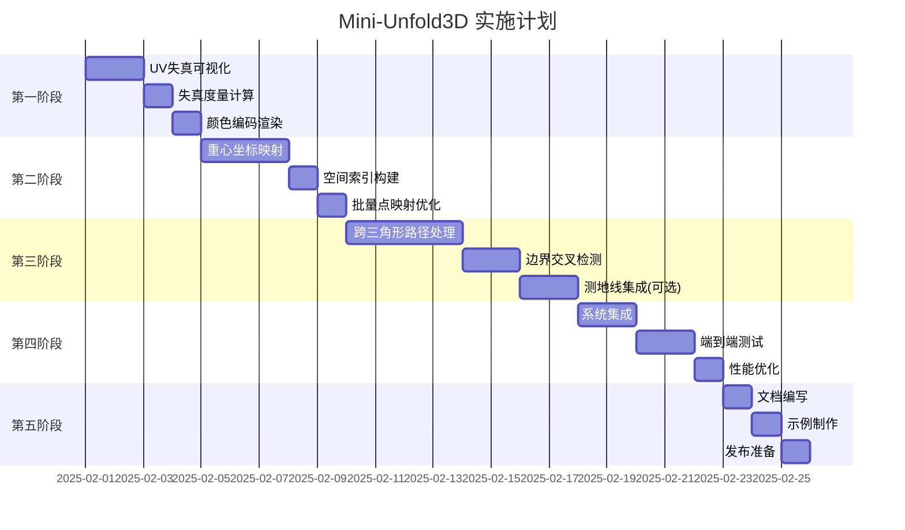

# Mini版Unfold3D Demo技术路线与实施计划
**版本**: 1.0
**日期**: 2025-01-30
**项目代号**: Mini-Unfold3D

---

## 目录

1. [项目概述](#1-项目概述)
2. [系统架构设计](#2-系统架构设计)
3. [核心模块详细说明](#3-核心模块详细说明)
4. [算法原理和实现细节](#4-算法原理和实现细节)
5. [实施计划和里程碑](#5-实施计划和里程碑)
6. [风险评估和应对策略](#6-风险评估和应对策略)
7. [技术栈和依赖](#7-技术栈和依赖)
8. [参考文献](#8-参考文献)

---

## 1. 项目概述

### 1.1 项目背景

Unfold3D是业界领先的UV展开工具，广泛应用于游戏、影视和工业设计领域。本项目旨在实现一个Mini版的Unfold3D演示系统，展示从3D模型到UV展开、失真分析、图案填充到3D回映射的完整工作流程。

### 1.2 项目目标

**主要目标**：
- 实现自动化的UV展开工作流程
- 提供UV失真的可视化分析工具
- 支持UV空间图案生成和3D回映射
- 构建可扩展的模块化架构

**技术目标**：
- 集成学术界最新的变分切割算法
- 实现高质量的BFF参数化
- 开发实时的失真度可视化
- 提供稳定的UV到3D映射算法

### 1.3 应用场景

- **纹理贴图制作**：为3D模型生成高质量UV坐标
- **图案设计**：在3D表面应用复杂的装饰图案
- **数字制造**：为3D打印和CNC加工生成刀具路径
- **科研教学**：作为计算几何和数字几何处理的教学工具

### 1.4 预期成果

- 完整的UV展开工作流程实现
- 支持多种网格格式输入输出
- 实时失真度可视化系统
- 丰富的图案生成和映射功能
- 详细的技术文档和示例代码

---

## 2. 系统架构设计

### 2.1 整体架构

```
┌─────────────────────────────────────────────────────────┐
│                    用户界面层 (UI Layer)                  │
│  ┌──────────────┐  ┌──────────────┐  ┌──────────────┐  │
│  │  ImGui界面   │  │  OpenGL渲染  │  │  交互控制   │  │
│  └──────────────┘  └──────────────┘  └──────────────┘  │
└─────────────────────────────────────────────────────────┘
                            ▼
┌─────────────────────────────────────────────────────────┐
│                   应用逻辑层 (Application)               │
│  ┌──────────────────────────────────────────────────┐  │
│  │           UV展开工作流程管理器                     │  │
│  │  (Workflow Manager & Pipeline Controller)        │  │
│  └──────────────────────────────────────────────────┘  │
└─────────────────────────────────────────────────────────┘
                            ▼
┌─────────────────────────────────────────────────────────┐
│                  算法模块层 (Algorithm Layer)            │
│  ┌──────────┐  ┌──────────┐  ┌──────────┐            │
│  │网格预处理│  │变分切割  │  │ BFF展开  │            │
│  └──────────┘  └──────────┘  └──────────┘            │
│  ┌──────────┐  ┌──────────┐  ┌──────────┐            │
│  │失真分析  │  │图案填充  │  │ 3D映射   │            │
│  └──────────┘  └──────────┘  └──────────┘            │
└─────────────────────────────────────────────────────────┘
                            ▼
┌─────────────────────────────────────────────────────────┐
│                   核心库层 (Core Libraries)              │
│  ┌──────────┐  ┌──────────────┐  ┌──────────┐        │
│  │   CGAL   │  │geometry-central│  │ Clipper2 │        │
│  └──────────┘  └──────────────┘  └──────────┘        │
│  ┌──────────┐  ┌──────────────┐  ┌──────────┐        │
│  │  Eigen3  │  │   OpenGL      │  │  ImGui   │        │
│  └──────────┘  └──────────────┘  └──────────┘        │
└─────────────────────────────────────────────────────────┘
```

### 2.2 数据流设计

```
输入3D模型 (.obj/.ply/.stl)
        ↓
┌──────────────────────┐
│   1. 网格预处理      │
│  - 流形化检查        │
│  - 等各向性重网格化  │
│  - 拓扑分析          │
└──────────────────────┘
        ↓
    预处理网格
        ↓
┌──────────────────────┐
│   2. 变分切割        │
│  - Yamabe能量优化    │
│  - 形状导数计算      │
│  - 水平集演化        │
└──────────────────────┘
        ↓
    带切缝网格
        ↓
┌──────────────────────┐
│   3. BFF UV展开      │
│  - 锥点检测          │
│  - 共形映射          │
│  - 边界优化          │
└──────────────────────┘
        ↓
    UV参数化结果
        ↓
┌──────────────────────┐
│  4. 失真分析可视化   │
│  - 角度失真计算      │
│  - 面积失真计算      │
│  - 拉伸失真计算      │
│  - 颜色编码映射      │
└──────────────────────┘
        ↓
    失真度量数据
        ↓
┌──────────────────────┐
│  5. UV空间图案生成   │
│  - 图案类型选择      │
│  - Clipper2布尔运算  │
│  - 边界裁剪          │
└──────────────────────┘
        ↓
    UV空间图案路径
        ↓
┌──────────────────────┐
│  6. 3D回映射         │
│  - 重心坐标计算      │
│  - 跨三角形路径处理  │
│  - 测地线生成        │
└──────────────────────┘
        ↓
    3D空间图案
        ↓
输出结果 (.obj + 纹理 + 路径)
```

### 2.3 模块间接口设计

```cpp
// 统一的网格数据结构
struct UnifiedMesh {
    std::shared_ptr<HalfedgeMesh> mesh;
    std::shared_ptr<VertexPositionGeometry> geometry;
    VertexData<Vector2> uvCoords;
    FaceData<int> chartIDs;  // UV图表标识
};

// 工作流程接口
class IWorkflowStep {
public:
    virtual bool process(UnifiedMesh& mesh) = 0;
    virtual std::string getName() const = 0;
    virtual void setParameters(const json& params) = 0;
    virtual json getResults() const = 0;
};

// 管道控制器
class PipelineController {
    std::vector<std::unique_ptr<IWorkflowStep>> steps;
    UnifiedMesh currentMesh;

public:
    void addStep(std::unique_ptr<IWorkflowStep> step);
    bool executeAll();
    bool executeStep(size_t index);
    void saveCheckpoint(const std::string& filename);
    void loadCheckpoint(const std::string& filename);
};
```

---

## 3. 核心模块详细说明

### 3.1 网格预处理模块 (MeshProcessor)

**功能职责**：
- 网格流形化和拓扑修复
- 等各向性重网格化
- 网格质量评估
- 边界和特征检测

**关键接口**：
```cpp
class MeshProcessor {
public:
    // 网格加载和验证
    bool loadMesh(const std::string& filename);
    bool validateManifold();

    // 重网格化
    void isotropicRemeshing(
        double targetEdgeLength,
        int iterations,
        bool projectToOriginal);

    // 拓扑操作
    void fillHoles();
    void removeIsolatedVertices();
    void fixNonManifoldEdges();

    // 质量度量
    struct QualityMetrics {
        double minAngle;
        double maxAngle;
        double avgEdgeLength;
        double aspectRatio;
    };
    QualityMetrics computeQuality();

private:
    std::unique_ptr<HalfedgeMesh> mesh;
    std::unique_ptr<VertexPositionGeometry> geometry;
};
```

### 3.2 变分切割模块 (VariationalCutter)

**功能职责**：
- 基于Yamabe方程的最优切缝生成
- 水平集方法的切割边界演化
- 能量函数优化
- 切缝应用到网格

**关键接口**：
```cpp
class VariationalCutter {
public:
    struct CutParameters {
        double lengthWeight = 1.0;      // 长度正则化
        double distortionWeight = 3.0;  // Hencky失真权重
        double visibilityWeight = 0.5;  // 可见性权重
        int maxIterations = 300;
        double convergenceTol = 1e-6;
    };

    // 切缝计算
    struct CutResult {
        std::vector<std::vector<Edge>> cutPaths;
        double finalEnergy;
        int iterationsUsed;
    };

    CutResult computeOptimalCuts(const CutParameters& params);

    // 应用切缝
    std::unique_ptr<HalfedgeMesh> applyCutsToMesh(const CutResult& cuts);

private:
    // 能量计算
    double computeYamabeEnergy();
    Vector<double> computeShapeDerivative();

    // 水平集演化
    void evolveLevelSet(double stepSize);
    void reinitializeLevelSet();
};
```

### 3.3 纹理映射模块 (TextureMapper)

**功能职责**：
- BFF (Boundary First Flattening) 算法实现
- 锥点检测和优化
- UV坐标生成
- 图表打包

**关键接口**：
```cpp
class TextureMapper {
public:
    struct MappingParameters {
        bool autoDetectCones = true;
        double coneAngleThreshold = M_PI / 6;
        bool minimizeDistortion = true;
        double packingMargin = 0.01;
    };

    struct UVMapping {
        VertexData<Vector2> uvCoords;
        FaceData<int> chartIDs;
        std::vector<double> coneAngles;
        double totalDistortion;
    };

    std::optional<UVMapping> computeUVMapping(
        const MappingParameters& params);

    // 导出功能
    void exportUVMesh(const std::string& filename,
                     const UVMapping& mapping);
    void exportUVLayout(const std::string& filename,
                       const UVMapping& mapping);

private:
    // BFF核心算法
    void computeBoundaryFirstFlattening();
    void detectConeVertices();
    void optimizeConeConfiguration();
};
```

### 3.4 失真分析模块 (UVDistortionAnalyzer) 🆕

**功能职责**：
- 计算各种失真度量
- 生成失真热力图
- 统计失真分布
- 失真纹理生成

**关键接口**：
```cpp
class UVDistortionAnalyzer {
public:
    struct DistortionMetrics {
        // 每面失真
        FaceData<double> angleDistortion;   // 角度失真
        FaceData<double> areaDistortion;    // 面积失真
        FaceData<double> stretchDistortion; // 拉伸失真

        // 每顶点失真（插值后）
        VertexData<double> vertexDistortion;
        VertexData<Vector3> perVertexColors;

        // 统计信息
        struct Statistics {
            double minDistortion;
            double maxDistortion;
            double avgDistortion;
            double stdDeviation;
            std::vector<double> histogram;
        } stats;
    };

    // 核心分析函数
    DistortionMetrics analyze(
        const HalfedgeMesh& mesh,
        const VertexPositionGeometry& geometry,
        const UVMapping& uvMapping);

    // 失真度量计算
    double computeAngleDistortion(Face f);
    double computeAreaDistortion(Face f);
    double computeStretchDistortion(Face f);

    // 颜色映射
    Vector3 distortionToColor(double distortion,
                             ColorMap colorMap = ColorMap::VIRIDIS);

private:
    // 辅助函数
    double computeTriangleAngles(const std::array<Vector3, 3>& vertices);
    double computeTriangleArea(const std::array<Vector3, 3>& vertices);
    Matrix2x2 computeJacobian(Face f);
};
```

### 3.5 表面填充模块 (SurfaceFiller)

**功能职责**：
- 多种图案类型生成
- UV空间布尔运算
- 边界裁剪
- 路径优化

**关键接口**：
```cpp
class SurfaceFiller {
public:
    enum class PatternType {
        GRID,           // 网格图案
        HEXAGONAL,      // 六边形图案
        SPIRAL,         // 螺旋图案
        HILBERT,        // 希尔伯特曲线
        CUSTOM          // 自定义图案
    };

    struct FillingParameters {
        PatternType type = PatternType::GRID;
        double spacing = 0.02;
        double lineWidth = 0.001;
        bool adaptiveDensity = false;
        VertexData<double> densityField;
    };

    struct FillingResult {
        std::vector<std::vector<Vector2>> pathsUV;
        double totalLength;
        int pathCount;
    };

    FillingResult generateFilling(const FillingParameters& params);

    // 导出功能
    void exportPathsToSVG(const std::vector<std::vector<Vector2>>& paths,
                         const std::string& filename);

private:
    // 图案生成器
    std::vector<std::vector<Vector2>> generateGridPattern(double spacing);
    std::vector<std::vector<Vector2>> generateHexagonalPattern(double spacing);
    std::vector<std::vector<Vector2>> generateSpiralPattern(double spacing);
    std::vector<std::vector<Vector2>> generateHilbertPattern(int order);

    // Clipper2集成
    void clipPathsToUVBoundary(std::vector<std::vector<Vector2>>& paths);
    void performBooleanOperations(std::vector<std::vector<Vector2>>& paths);
};
```

### 3.6 重心映射模块 (BarycentricMapper) 🆕

**功能职责**：
- UV点到3D点的映射
- 重心坐标计算
- 空间索引构建
- 数值稳定性处理

**关键接口**：
```cpp
class BarycentricMapper {
public:
    struct MappingConfig {
        double epsilon = 1e-8;          // 数值容差
        bool useAcceleration = true;    // 使用空间加速结构
        int gridResolution = 100;       // 空间网格分辨率
    };

    // 初始化
    void initialize(const HalfedgeMesh& mesh,
                   const VertexPositionGeometry& geometry,
                   const UVMapping& uvMapping,
                   const MappingConfig& config = {});

    // 单点映射
    std::optional<Vector3> mapUVTo3D(const Vector2& uvPoint);

    // 批量点映射
    std::vector<Vector3> mapUVPointsTo3D(
        const std::vector<Vector2>& uvPoints);

    // 路径映射
    std::vector<Vector3> mapUVPathTo3D(
        const std::vector<Vector2>& uvPath,
        bool interpolate = true);

    // 查询函数
    std::optional<Face> findContainingTriangle(const Vector2& uvPoint);
    Vector3 computeBarycentricCoords(const Vector2& point,
                                     const Face& triangle);

private:
    // 空间加速结构
    struct SpatialIndex {
        // 使用CGAL的AABB树
        typedef CGAL::AABB_tree</*..*/> AABBTree;
        std::unique_ptr<AABBTree> tree;

        // 或使用网格索引
        struct GridCell {
            std::vector<Face> faces;
        };
        std::vector<std::vector<GridCell>> grid;
    };

    SpatialIndex spatialIndex;

    // 辅助函数
    bool pointInTriangle(const Vector2& p,
                        const Vector2& a,
                        const Vector2& b,
                        const Vector2& c);

    Vector3 interpolate3DPosition(const Vector3& baryCoords,
                                 const Face& face);
};
```

### 3.7 图案回映射模块 (PatternBackMapper) 🆕

**功能职责**：
- UV图案到3D曲面的完整映射
- 跨三角形路径处理
- 测地线计算（可选）
- 路径连续性保证

**关键接口**：
```cpp
class PatternBackMapper {
public:
    struct BackMappingConfig {
        bool useGeodesic = false;       // 是否使用测地线
        bool splitAtEdges = true;       // 是否在边界分割路径
        double samplingDensity = 0.001; // 路径采样密度
        bool preserveTopology = true;   // 保持拓扑结构
    };

    struct MappedPattern {
        std::vector<std::vector<Vector3>> paths3D;
        std::vector<double> pathLengths;
        double totalLength;

        // 映射质量指标
        struct QualityMetrics {
            double maxDeviation;        // 最大偏差
            double avgDeviation;         // 平均偏差
            int discontinuities;        // 不连续点数量
        } quality;
    };

    // 主映射函数
    MappedPattern mapPatternTo3D(
        const FillingResult& uvPattern,
        const UVMapping& uvMapping,
        const HalfedgeMesh& mesh,
        const VertexPositionGeometry& geometry,
        const BackMappingConfig& config = {});

    // 导出功能
    void exportPaths3D(const MappedPattern& pattern,
                      const std::string& filename);

    void exportAsPolylines(const MappedPattern& pattern,
                          const std::string& filename);

private:
    // 路径映射核心
    std::vector<Vector3> mapSinglePath(
        const std::vector<Vector2>& uvPath);

    // 跨三角形处理
    struct PathSegment {
        Face face;
        Vector2 entryPoint;
        Vector2 exitPoint;
        Edge crossedEdge;
    };

    std::vector<PathSegment> computePathSegments(
        const Vector2& start,
        const Vector2& end);

    // 边界处理
    Vector3 computeEdgeCrossing(
        const Edge& edge,
        const Vector2& uvPoint,
        const Vector3& baryCoords);

    // 测地线计算（使用CGAL）
    std::vector<Vector3> computeGeodesicPath(
        const Vector3& start,
        const Vector3& end,
        const HalfedgeMesh& mesh);

    // 连续性修复
    void ensurePathContinuity(
        std::vector<Vector3>& path,
        double tolerance = 1e-6);
};
```

### 3.8 可视化模块 (UVVisualization) 🆕

**功能职责**：
- 失真度可视化渲染
- 纹理图生成
- UV布局显示
- 3D/UV对比视图

**关键接口**：
```cpp
class UVVisualization {
public:
    struct VisualizationConfig {
        enum ViewMode {
            VIEW_3D,           // 3D视图
            VIEW_UV,           // UV平面视图
            VIEW_SPLIT,        // 分屏对比
            VIEW_OVERLAY       // 叠加显示
        };

        ViewMode mode = VIEW_SPLIT;
        bool showWireframe = true;
        bool showDistortion = true;
        bool showCuts = true;
        float wireframeWidth = 1.0f;
    };

    // 渲染函数
    void render(const VisualizationConfig& config);

    // 失真纹理生成
    void generateDistortionTexture(
        const UVMapping& mapping,
        const DistortionMetrics& distortion,
        const std::string& filename,
        int resolution = 1024);

    // 颜色映射
    void applyDistortionColors(
        const HalfedgeMesh& mesh,
        const VertexData<Vector3>& colors);

    // UV布局渲染
    void renderUVLayout(
        const UVMapping& mapping,
        const ImVec2& canvasSize);

    // 交互式失真图
    void renderInteractiveHeatmap(
        const DistortionMetrics& distortion,
        ImGuiIO& io);

private:
    // OpenGL资源
    struct GLResources {
        GLuint meshVAO, meshVBO, meshEBO;
        GLuint uvVAO, uvVBO, uvEBO;
        GLuint distortionTexture;
        GLuint shaderProgram;
    } glResources;

    // 着色器管理
    void compileShaders();
    void updateBuffers();
};
```

---

## 4. 算法原理和实现细节

### 4.1 变分切割算法原理

#### 4.1.1 Yamabe能量函数

变分切割基于Yamabe流，通过最小化以下能量函数寻找最优切缝：

$$E_{total} = \alpha E_{length} + \beta E_{distortion} + \gamma E_{visibility}$$

其中：
- $E_{length}$：切缝长度正则化项
- $E_{distortion}$：Hencky失真度量
- $E_{visibility}$：可见性约束项

#### 4.1.2 水平集演化

使用水平集方法隐式表示切缝边界：

$$\frac{\partial \phi}{\partial t} + F|\nabla \phi| = 0$$

其中$\phi$是水平集函数，$F$是速度场，由形状导数决定。

#### 4.1.3 形状导数计算

```cpp
Vector<double> VariationalCutter::computeShapeDerivative() {
    Vector<double> derivative(mesh->nVertices());

    for (Vertex v : mesh->vertices()) {
        double lengthGrad = computeLengthGradient(v);
        double distortionGrad = computeDistortionGradient(v);
        double visibilityGrad = computeVisibilityGradient(v);

        derivative[v.getIndex()] =
            params.lengthWeight * lengthGrad +
            params.distortionWeight * distortionGrad +
            params.visibilityWeight * visibilityGrad;
    }

    return derivative;
}
```

### 4.2 BFF算法原理

#### 4.2.1 共形映射

BFF通过求解以下线性系统实现共形映射：

$$\Delta u = K - \tilde{K}$$

其中：
- $\Delta$：离散拉普拉斯算子
- $K$：原始高斯曲率
- $\tilde{K}$：目标高斯曲率
- $u$：对数共形因子

#### 4.2.2 锥点优化

锥点配置通过贪心算法选择：

```cpp
void TextureMapper::optimizeConeConfiguration() {
    std::priority_queue<ConeCandidate> candidates;

    // 评估所有顶点作为锥点的收益
    for (Vertex v : mesh->vertices()) {
        if (!v.isBoundary()) {
            double benefit = evaluateConeVertex(v);
            candidates.push({v, benefit});
        }
    }

    // 贪心选择锥点
    std::set<Vertex> cones;
    while (!candidates.empty() && cones.size() < maxCones) {
        ConeCandidate best = candidates.top();
        candidates.pop();

        if (best.benefit > threshold) {
            cones.insert(best.vertex);
            updateNeighborBenefits(best.vertex);
        }
    }
}
```

### 4.3 失真度量计算

#### 4.3.1 角度失真

衡量UV映射前后三角形内角的变化：

```cpp
double UVDistortionAnalyzer::computeAngleDistortion(Face f) {
    // 获取3D和UV空间的三个顶点
    std::array<Vector3, 3> pos3D = getFaceVertices3D(f);
    std::array<Vector2, 3> posUV = getFaceVerticesUV(f);

    // 计算3D空间的三个内角
    std::array<double, 3> angles3D;
    for (int i = 0; i < 3; i++) {
        Vector3 v1 = pos3D[(i+1)%3] - pos3D[i];
        Vector3 v2 = pos3D[(i+2)%3] - pos3D[i];
        angles3D[i] = acos(dot(v1, v2) / (norm(v1) * norm(v2)));
    }

    // 计算UV空间的三个内角
    std::array<double, 3> anglesUV;
    for (int i = 0; i < 3; i++) {
        Vector2 v1 = posUV[(i+1)%3] - posUV[i];
        Vector2 v2 = posUV[(i+2)%3] - posUV[i];
        anglesUV[i] = acos(dot(v1, v2) / (norm(v1) * norm(v2)));
    }

    // 计算最大角度偏差
    double maxDeviation = 0;
    for (int i = 0; i < 3; i++) {
        maxDeviation = std::max(maxDeviation,
                               std::abs(angles3D[i] - anglesUV[i]));
    }

    return maxDeviation / M_PI;  // 归一化到[0,1]
}
```

#### 4.3.2 面积失真

比较UV映射前后三角形面积的比率：

```cpp
double UVDistortionAnalyzer::computeAreaDistortion(Face f) {
    double area3D = geometry->faceArea(f);
    double areaUV = computeUVFaceArea(f);

    // 计算面积比率（对数空间）
    double ratio = areaUV / area3D;
    return std::abs(std::log(ratio));
}
```

#### 4.3.3 拉伸失真

基于雅可比矩阵的奇异值分解：

```cpp
double UVDistortionAnalyzer::computeStretchDistortion(Face f) {
    // 计算映射的雅可比矩阵
    Matrix2x2 J = computeJacobian(f);

    // SVD分解获取奇异值
    Eigen::JacobiSVD<Eigen::Matrix2d> svd(J);
    double s1 = svd.singularValues()(0);
    double s2 = svd.singularValues()(1);

    // L2拉伸度量
    double L2_stretch = sqrt((s1*s1 + s2*s2) / 2.0);

    // L∞拉伸度量
    double Linf_stretch = std::max(s1, s2);

    // 综合拉伸失真
    return 0.5 * (L2_stretch + Linf_stretch);
}
```

### 4.4 重心坐标映射算法

#### 4.4.1 点定位算法

使用AABB树加速UV点定位：

```cpp
std::optional<Face> BarycentricMapper::findContainingTriangle(
    const Vector2& uvPoint) {

    if (config.useAcceleration) {
        // 使用AABB树查询
        auto query = spatialIndex.tree->query(uvPoint);
        if (query.has_value()) {
            return query.value();
        }
    } else {
        // 暴力搜索
        for (Face f : mesh->faces()) {
            if (pointInTriangle(uvPoint, f)) {
                return f;
            }
        }
    }

    return std::nullopt;
}
```

#### 4.4.2 重心坐标计算

```cpp
Vector3 BarycentricMapper::computeBarycentricCoords(
    const Vector2& p, const Face& triangle) {

    // 获取三角形的UV坐标
    auto vertices = triangle.adjacentVertices();
    Vector2 a = uvCoords[vertices[0]];
    Vector2 b = uvCoords[vertices[1]];
    Vector2 c = uvCoords[vertices[2]];

    // 计算重心坐标
    Vector2 v0 = c - a;
    Vector2 v1 = b - a;
    Vector2 v2 = p - a;

    double d00 = dot(v0, v0);
    double d01 = dot(v0, v1);
    double d11 = dot(v1, v1);
    double d20 = dot(v2, v0);
    double d21 = dot(v2, v1);

    double denom = d00 * d11 - d01 * d01;

    // 数值稳定性检查
    if (std::abs(denom) < config.epsilon) {
        // 退化三角形处理
        return handleDegenerateCase(p, triangle);
    }

    double v = (d11 * d20 - d01 * d21) / denom;
    double w = (d00 * d21 - d01 * d20) / denom;
    double u = 1.0 - v - w;

    return Vector3(u, v, w);
}
```

### 4.5 跨三角形路径映射

#### 4.5.1 路径分段算法

```cpp
std::vector<PathSegment> PatternBackMapper::computePathSegments(
    const Vector2& start, const Vector2& end) {

    std::vector<PathSegment> segments;

    // 找到起始三角形
    auto startFace = mapper.findContainingTriangle(start);
    if (!startFace) return segments;

    Vector2 current = start;
    Face currentFace = *startFace;

    while (norm(current - end) > epsilon) {
        PathSegment segment;
        segment.face = currentFace;
        segment.entryPoint = current;

        // 计算射线与三角形边的交点
        auto intersection = computeRayTriangleExit(
            current, end - current, currentFace);

        if (intersection.has_value()) {
            segment.exitPoint = intersection->point;
            segment.crossedEdge = intersection->edge;

            // 移动到相邻三角形
            currentFace = intersection->edge.twin().face();
            current = segment.exitPoint;

            // 添加小偏移避免数值问题
            Vector2 direction = normalize(end - current);
            current = current + epsilon * direction;
        } else {
            // 路径终点在当前三角形内
            segment.exitPoint = end;
            segments.push_back(segment);
            break;
        }

        segments.push_back(segment);
    }

    return segments;
}
```

#### 4.5.2 测地线计算（可选）

使用CGAL的Surface_mesh_shortest_path：

```cpp
std::vector<Vector3> PatternBackMapper::computeGeodesicPath(
    const Vector3& start, const Vector3& end,
    const HalfedgeMesh& mesh) {

    // 转换为CGAL格式
    CGAL::Surface_mesh<Point_3> cgalMesh = convertToCGAL(mesh);

    // 构建最短路径查询对象
    typedef CGAL::Surface_mesh_shortest_path<
        CGAL::Surface_mesh<Point_3>,
        CGAL::Surface_mesh_shortest_path_traits<Point_3>
    > Shortest_path;

    Shortest_path shortestPath(cgalMesh);

    // 设置源点
    shortestPath.add_source_point(toCGALPoint(start));

    // 计算到目标点的最短路径
    auto pathPoints = shortestPath.shortest_path_points_to_source_points(
        toCGALPoint(end));

    // 转换回内部格式
    std::vector<Vector3> geodesicPath;
    for (const auto& p : pathPoints) {
        geodesicPath.push_back(fromCGALPoint(p));
    }

    return geodesicPath;
}
```

---

## 5. 实施计划和里程碑

### 5.1 项目时间线



### 5.2 里程碑定义

#### M1: 基础可视化完成（第3天）
- ✅ UV失真度量计算实现
- ✅ 失真热力图渲染
- ✅ ImGui集成显示
- **交付物**: 可视化失真的UV展开结果

#### M2: 映射核心完成（第8天）
- ✅ 重心坐标映射实现
- ✅ 空间加速结构构建
- ✅ 批量映射优化
- **交付物**: UV到3D的点映射功能

#### M3: 路径映射完成（第15天）
- ✅ 跨三角形路径处理
- ✅ 边界处理算法
- ✅ 连续性保证
- **交付物**: 完整的图案回映射功能

#### M4: 系统集成完成（第20天）
- ✅ 全流程集成测试
- ✅ 性能达标（<5秒处理10k面片）
- ✅ Bug修复完成
- **交付物**: 可发布的Demo系统

#### M5: 项目交付（第23天）
- ✅ 完整文档
- ✅ 示例和教程
- ✅ 发布包准备
- **交付物**: 完整的Mini-Unfold3D系统

### 5.3 资源分配

| 阶段 | 人力需求 | 主要技能要求 | 工作量(人天) |
|------|----------|--------------|--------------|
| 失真可视化 | 1人 | OpenGL, 图形学 | 2 |
| 重心映射 | 1人 | 计算几何, 数值计算 | 3 |
| 路径映射 | 2人 | 算法, CGAL | 5 |
| 系统集成 | 1人 | C++, 软件工程 | 3 |
| 测试优化 | 1人 | 测试, 性能分析 | 2 |
| 文档 | 1人 | 技术写作 | 2 |

**总计**: 约17人天

### 5.4 测试计划

#### 单元测试
```cpp
// 失真计算测试
TEST(DistortionTest, AngleDistortion) {
    // 创建一个等边三角形
    auto triangle = createEquilateralTriangle();

    // UV映射为直角三角形
    auto uvMapping = mapToRightTriangle();

    // 计算失真
    UVDistortionAnalyzer analyzer;
    auto distortion = analyzer.computeAngleDistortion(triangle);

    // 验证失真值
    EXPECT_NEAR(distortion, expectedValue, 1e-6);
}

// 重心坐标测试
TEST(BarycentricTest, PointMapping) {
    // 测试三角形内部点
    Vector2 uvPoint(0.3, 0.4);
    auto mapped3D = mapper.mapUVTo3D(uvPoint);
    ASSERT_TRUE(mapped3D.has_value());

    // 验证映射正确性
    auto remapped = projectTo2D(mapped3D.value());
    EXPECT_NEAR(distance(remapped, uvPoint), 0, 1e-6);
}
```

#### 集成测试
- data/spot.obj模型完整流程测试
- data/bunny.obj模型性能测试
- 复杂拓扑模型鲁棒性测试

#### 性能基准
| 模型规模 | 预处理 | 切割 | UV展开 | 失真分析 | 图案映射 | 总时间 |
|---------|--------|------|---------|----------|----------|--------|
| 1k面片 | <0.1s | <0.5s | <0.2s | <0.1s | <0.3s | <1.5s |
| 10k面片 | <0.5s | <2s | <1s | <0.5s | <1s | <5s |
| 100k面片 | <5s | <20s | <10s | <5s | <10s | <50s |

---

## 6. 风险评估和应对策略

### 6.1 技术风险

#### 风险1: 数值稳定性问题 🔴 高
**描述**: 重心坐标计算在退化三角形或边界点可能失败

**影响**:
- 映射结果不正确
- 程序崩溃
- 视觉瑕疵

**缓解措施**:
1. 实现robust几何谓词
2. 使用精确算术库（CGAL Exact_predicates）
3. 添加epsilon容差处理
4. 退化情况特殊处理

```cpp
// 鲁棒性处理示例
Vector3 computeRobustBarycentricCoords(const Vector2& p,
                                       const Face& triangle) {
    // 使用CGAL精确谓词
    typedef CGAL::Exact_predicates_inexact_constructions_kernel K;
    K::Point_2 query(p.x, p.y);

    // 转换为CGAL三角形
    K::Triangle_2 cgalTriangle = convertToCGAL(triangle);

    // 精确的包含测试
    if (!cgalTriangle.has_on(query)) {
        // 寻找最近的三角形
        return findNearestTriangle(p);
    }

    // 计算重心坐标
    auto coords = CGAL::barycentric_coordinates(query, cgalTriangle);
    return Vector3(coords[0], coords[1], coords[2]);
}
```

#### 风险2: 性能瓶颈 🟡 中
**描述**: 大规模网格处理可能超时

**影响**:
- 用户体验差
- 内存溢出
- 响应迟缓

**缓解措施**:
1. 实现LOD (Level of Detail) 策略
2. 并行化计算密集型操作
3. 使用空间数据结构加速
4. 增量式处理

```cpp
// 并行化示例
void processLargeMesh(const HalfedgeMesh& mesh) {
    #pragma omp parallel for
    for (int i = 0; i < mesh.nFaces(); i++) {
        Face f = mesh.face(i);
        processTriangle(f);
    }
}
```

#### 风险3: 跨平台兼容性 🟡 中
**描述**: Windows/Linux/Mac表现不一致

**影响**:
- 构建失败
- 功能差异
- 性能差异

**缓解措施**:
1. 使用CMake管理构建
2. 避免平台特定API
3. CI/CD多平台测试
4. 条件编译处理差异

### 6.2 项目风险

#### 风险4: 依赖库版本冲突 🟡 中
**描述**: CGAL、Eigen、geometry-central版本不兼容

**影响**:
- 编译错误
- 运行时错误
- 功能缺失

**缓解措施**:
1. 使用vcpkg固定版本
2. 创建Docker容器
3. 详细记录依赖版本
4. 提供预编译包

#### 风险5: 需求变更 🟢 低
**描述**: 功能需求在开发中变化

**影响**:
- 延期交付
- 重复工作
- 架构调整

**缓解措施**:
1. 模块化设计
2. 迭代开发
3. 早期原型验证
4. 及时沟通确认

### 6.3 风险矩阵

```
影响程度
    ↑
高  │ R1:数值稳定性 │              │              │
    │              │              │              │
中  │              │ R2:性能瓶颈  │              │
    │              │ R3:跨平台    │              │
    │              │ R4:依赖冲突  │              │
低  │              │              │ R5:需求变更  │
    └──────────────┴──────────────┴──────────────┘
      低            中             高
                   发生概率 →

图例: R1-R5 为已识别风险
```

### 6.4 应急计划

**Plan A (主计划)**: 完整实现所有功能
- 时间: 23天
- 资源: 2-3人
- 成功率: 70%

**Plan B (降级计划)**: 核心功能+简化版本
- 移除测地线计算
- 简化失真可视化
- 时间: 18天
- 成功率: 90%

**Plan C (最小可行版本)**: 仅实现基础映射
- 仅支持单一UV图表
- 基础重心映射
- 时间: 12天
- 成功率: 95%

---

## 7. 技术栈和依赖

### 7.1 核心依赖

| 库名 | 版本 | 用途 | 许可证 |
|------|------|------|--------|
| CGAL | 5.5+ | 计算几何算法 | GPL/LGPL |
| geometry-central | latest | 离散微分几何 | MIT |
| Eigen3 | 3.4+ | 线性代数 | MPL2 |
| Clipper2 | 1.2+ | 布尔运算 | Boost |
| ImGui | 1.89+ | 用户界面 | MIT |
| OpenGL | 3.3+ | 3D渲染 | - |
| GLM | 0.9.9+ | 数学库 | MIT |
| spdlog | 1.11+ | 日志系统 | MIT |

### 7.2 构建工具

```cmake
# CMakePresets.json
{
  "version": 3,
  "configurePresets": [
    {
      "name": "unfold3d-debug",
      "displayName": "Unfold3D Debug",
      "generator": "Ninja",
      "binaryDir": "${sourceDir}/build/${presetName}",
      "cacheVariables": {
        "CMAKE_BUILD_TYPE": "Debug",
        "CMAKE_CXX_STANDARD": "17",
        "ENABLE_TESTING": "ON",
        "BUILD_EXAMPLES": "ON"
      }
    }
  ]
}
```

### 7.3 开发环境

**推荐配置**:
- 操作系统: Windows 10/11, Ubuntu 20.04+, macOS 11+
- 编译器: MSVC 2019+, GCC 9+, Clang 12+
- CMake: 3.20+
- vcpkg: latest
- GPU: 支持OpenGL 3.3+

**IDE支持**:
- Visual Studio 2022 (推荐)
- Visual Studio Code + CMake Tools
- CLion
- Qt Creator

---

## 8. 参考文献

### 学术论文

1. **Variational Surface Cutting**
   - Sharp, N., & Crane, K. (2018)
   - ACM Transactions on Graphics (TOG)
   - 提供了变分切割的理论基础

2. **Boundary First Flattening**
   - Sawhney, R., & Crane, K. (2017)
   - ACM Transactions on Graphics (TOG)
   - BFF算法的原始论文

3. **Least Squares Conformal Maps**
   - Lévy, B., et al. (2002)
   - ACM SIGGRAPH
   - 共形映射的经典方法

4. **ABF++: Fast and Robust Angle Based Flattening**
   - Sheffer, A., et al. (2005)
   - ACM Transactions on Graphics
   - 角度保持的参数化方法

5. **Geodesics in Heat**
   - Crane, K., et al. (2013)
   - ACM Transactions on Graphics
   - 快速测地线计算

### 技术文档

6. **CGAL用户手册**
   - https://doc.cgal.org/latest/Manual/index.html
   - 特别是Surface_mesh和BGL章节

7. **geometry-central文档**
   - https://geometry-central.net/
   - 离散微分几何操作指南

8. **OpenGL编程指南**
   - https://www.opengl.org/documentation/
   - 渲染管线和着色器编程

### 开源项目

9. **libigl**
   - https://libigl.github.io/
   - 提供了许多几何处理算法参考

10. **Blender UV工具源码**
    - https://github.com/blender/blender
    - 工业级UV展开实现参考

### 书籍

11. **Polygon Mesh Processing**
    - Botsch, M., et al. (2010)
    - A K Peters/CRC Press
    - 网格处理的全面介绍

12. **Discrete Differential Geometry**
    - Crane, K. (2020)
    - 离散微分几何的现代方法

---

## 附录A: 代码组织结构

```
mini-unfold3d/
├── CMakeLists.txt
├── CMakePresets.json
├── vcpkg.json
├── README.md
├── docs/
│   ├── API_REFERENCE.md
│   ├── USER_MANUAL.md
│   └── TECHNICAL_ROADMAP.md
├── src/
│   ├── core/
│   │   ├── MeshProcessor.h/cpp
│   │   ├── VariationalCutter.h/cpp
│   │   ├── TextureMapper.h/cpp
│   │   ├── UVDistortionAnalyzer.h/cpp
│   │   ├── SurfaceFiller.h/cpp
│   │   ├── BarycentricMapper.h/cpp
│   │   └── PatternBackMapper.h/cpp
│   ├── visualization/
│   │   ├── UVVisualization.h/cpp
│   │   ├── Renderer.h/cpp
│   │   └── ImGuiInterface.h/cpp
│   ├── utils/
│   │   ├── Timer.h
│   │   ├── Logger.h
│   │   └── FileIO.h/cpp
│   └── main.cpp
├── shaders/
│   ├── mesh.vert
│   ├── mesh.frag
│   ├── distortion.vert
│   └── distortion.frag
├── tests/
│   ├── test_distortion.cpp
│   ├── test_barycentric.cpp
│   ├── test_backmapping.cpp
│   └── test_integration.cpp
├── examples/
│   ├── simple_uv_unwrap.cpp
│   ├── distortion_analysis.cpp
│   └── pattern_mapping.cpp
└── data/
    ├── models/
    │   ├── spot.obj
    │   ├── bunny.obj
    │   └── teapot.obj
    └── patterns/
        ├── grid.svg
        ├── hexagon.svg
        └── spiral.svg
```

## 附录B: 性能优化建议

### B.1 内存优化
- 使用内存池管理小对象分配
- 实现Copy-on-Write for大型数据结构
- 及时释放不需要的中间结果

### B.2 计算优化
- 使用SIMD指令加速向量运算
- OpenMP并行化独立的三角形处理
- GPU加速失真计算（CUDA/OpenCL）

### B.3 渲染优化
- 实现视锥剔除
- LOD系统for大规模网格
- 实例化渲染for重复图案

### B.4 算法优化
- 使用自适应精度控制
- 实现增量式更新
- 缓存重复计算结果

---

**文档结束**

本技术路线图提供了Mini版Unfold3D Demo的完整实施方案。文档将随项目进展持续更新。

如有疑问或建议，请联系项目技术负责人。